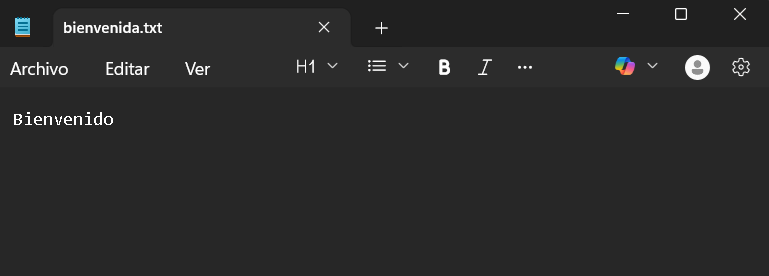
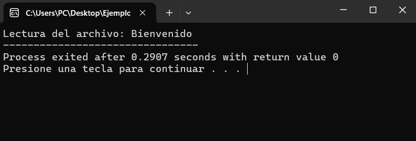
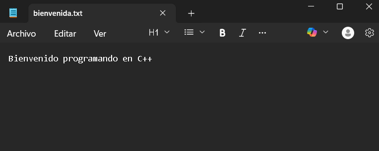
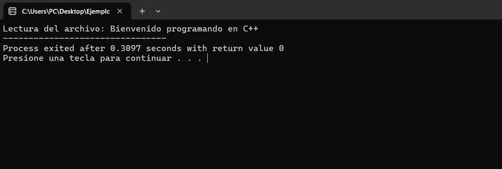

# Manejo de archivos - `C++`


En `C++`, los programas se ejecutan en la **RAM** (memoria de acceso aleatorio) del ordenador. Los datos almacenados en **RAM** existen solo mientras el programa está en ejecución y se eliminan automáticamente al finalizar. 

El manejo de archivos permite trabajar con la memoria secundaria del ordenador (como discos duros y SSD), almacenando datos de manera permanente. Esto hace posible conservar la información y acceder a ella incluso después de que el programa haya terminado de ejecutarse.

### <iostream>

En C++, la entrada y la salida se manejan mediante secuencias de `bytes` llamados flujos (*streams*). Por ejemplo, `cin` y `cout` son objetos que representan los flujos de entrada y salida estándar, respectivamente. Estos flujos están implementados mediante clases como `istream` y `ostream`, que forman parte de la biblioteca `<iostream>`.

### <fstream>

De manera similar, `C++` también proporciona clases de flujo para trabajar con archivos, definidas en el archivo de encabezado `<fstream>`.

## Operaciones de manejo de archivos

En `C++`, el manejo de archivos generalmente sigue tres pasos principales:

1. Abrir un archivo.
2. Realizar operaciones de lectura y/o escritura.
3. Cerrar el archivo.

- **Abrir un archivo**

Antres de leer o escribir en un archivo, primero debemos abrirlo. Al abrir un archivo, este se carga en la **RAM**. En `C++`, abrimos un archivo creando un flujo de datos con la clase `fstream`, que representa el flujo de datos de entrada y salida del archivo.

**Sintaxis**:

```C++
fstream str("nombre_de_archivo.ext", modo);
```

- str: Nombre dado al stream.
- nombre_de_archivo: Nombre del archivo.
- modo: Representa la forma en la que vamos a interactuar con el archivo.

### Modos de apertura de archivos.

El modo de apertura de archivos indica si el archivo se abre para lectura, escritura o adición de datos. A continuación, se muestra la lista de todos los modos de archivo en `C++`:

<table>
    <thead>   
            <th>Modo</th>
            <th>Descripción</th>
    </thead>
    <tbody>
        <tr>
            <td class="modo">ios::in</td>
            <td>Archivo abierto para lectura.</td>
        </tr>
        <tr>
            <td class="modo">ios::out</td>
            <td>Archivo abierto para escritura.</td>
        </tr>
         <tr>
            <td class="modo">ios::binary</td>
            <td>Las operaciones se realizan en modo binario en lugar de texto.</td>
        </tr>
         <tr>
            <td class="modo">ios::ate</td>
            <td>Abre el archivo y posiciona el puntero de escritura/ lectura al final del archivo. </td>
        </tr>
        <tr>
            <td class="modo">ios::app</td>
            <td>Abre el archivo y posiciona el puntero de escritura al final del archivo. </td>
        </tr>
        <tr>
            <td class="modo">ios::trunc</td>
            <td>Su función es borrar completamente el contenido del archivo al abrirlo. </td>
        </tr>
    </tbody>
</table>

<style>
    .modo{
        font-size:20px;
         font-weight: 800;
         font-family:Arial;
    }
</style>

### Lectura.

Por ejemplo, si queremos abrir el archivo para leerlo, utilizamos el siguiente modo de apertura:

```C++
fstream filein("file.txt", ios::in);
```

<hr>
<br>

### Escritura.

De la misma manera, si queremos abrir el archivo para escribir, utilizamos lo siguiente:

```C++
fstream fileout("file.txt", ios::out);
```

<hr>
<br>

### Lectura / Escritura

Estos modos también se pueden combinar mediante el operador `OR (|)`. Por ejemplo, puede abrir el flujo de archivos tanto en modo de lectura como de escritura, como se muestra a continuación:

```C++
fstream str("file.txt", ios::in | ios::out);
```

<hr>
<br>

*Si el archivo abierto en modo de escritura no existe, se crea uno nuevo. Si el archivo abierto en modo de lectura no existe, no se crea y se genera una excepción.

## Otros flujos de archivos.

`fstream` no es el únicco flujo de archivos que ofrece `C++`. Existen dos flujos más especializados:

- `ifstream`: Significa flujo de archivo de entrada. Equivale a abrir `fstream` en modo **ios::in**.

- `ofstream`: Significa flujo de archivos de salida. Equivale a abrir `fstream` en modo **ios::out**.

Los modos anteriores son los predeterminados para estos flujos. No se pueden modificar, pero se pueden combinar con otros. Para la entrada, también podemos usar `ifstream` como se muestra:

```C++
ifstream filein("file.txt");
```

De manera similar, para la salida:

```C++
ofstream fileout("file.txt");
```

## Escribir datos en un archivo.

Una vez que el archivo se abre en el modo de escritura usando `fstream` o `ofstream`, podemos realizar la operación de escritura de manera similar como `cout` usando el operador **<<**.

**Ejemplo**:

```C++
#include <iostream>
#include<fstream>
using namespace std;
int main() 
	{	
		ofstream file("bienvenida.txt"); // Crea y abre un archivo.
		file << "Bienvenido";			// Escribir texto en el archivo.
		return 0;
	}
```

Crea el archivo `bienvenida.txt`.

*Visualización del explorador de **Windows***.


*Visualización del archivo*.




<hr>
<br>

## Leer datos del archivo.

Una vez que el archivo se abre en el modo de lectura usando `fstream` o `ifstream`, podemos realizar la operación de escritura de manera similar a como lo hacemos con `cin` usando el operador **>>**.

**Ejemplo**:
```C++
#include <iostream>
#include<fstream>
#include<string>
using namespace std;
int main() 
	{	
		ifstream archivo("bienvenida.txt"); // Abrir el archivo.
		string s;
		
		archivo >> s;			// Asigna el valor del archivo en la variable de tipo string s.
		
		cout<< "Lectura del archivo: "<< s; //Muestra en la consola el contenido del archivo.
		return 0;
	}
```


*Visualización del explorador de **Windows***.


*Visualización de la consola.*



Esto presenta el mismo problema que `cin`. La entrada solo se toma hasta el primer espacio en blanco. Para evitarlo, podemos usar la función `getline()`.

**Ejemplo**:

```C++
#include <iostream>
#include<fstream>
#include<string>
using namespace std;
int main() 
	{	
		ifstream archivo("bienvenida.txt"); // Abrir el archivo.
		string s;
		
		getline(archivo, s);			// Asigna el valor del archivo en la variable de tipo string s.
		
		cout<< "Lectura del archivo: "<< s; //Muestra en la consola el contenido del archivo.
		return 0;
	}
```

*Visualización del archivo `bienvenida.txt`.*



*Visualización de la consola.*



<hr>
<br>

## Cerrado del archivo.

Cerrar el archivo significa cerrar el flujo asociado y liberar los recursos que se estaba utilizando. Es importante cerrar el archivo all terminar de usarlo, especialmente en programas de larga duración para evitar fugas de memoria, pérdida de datos, etc.

En `C++`, los archivos se cierran utilizando la función `close()`:

```C++
#include <iostream>
#include<fstream>
#include<string>
using namespace std;
int main() 
	{	
		ifstream archivo("bienvenida.txt"); // Abrir el archivo.
		string s;
		
		getline(archivo, s);			// Asigna el valor del archivo en la variable de tipo string s.
		
		cout<< "Lectura del archivo: "<< s; //Muestra en la consola el contenido del archivo.
        archivo.close(); // Cerrar el archivo.
		return 0;
	}
```

## Errores en el manejo de archivos.

Pueden ocurrir diversos tipos de errores durante la gestión de archivos, como archivos no encontrados, disco lleno, etc. Nuestros programas deberían anticipar errores comunes y ser capaces de gestionarlos correctamente. A continiuación, se presentan algunos errores comunes que pueden ocurrir durante la gestión de archivos:

Puede haber casos en los que el archivo no se abra debido a varias razones, como que no existeo el programa no tiene permiso para abrirlo, etc. En este caso, podemos usar la función `is_open()` para verificar si el archivo se abrió correctamente o no.

**Ejemplo**:

```C++
#include <iostream>
#include<fstream>

using namespace std;

int main() {
    fstream archivo("archivo_inexistente.txt", ios::in);

    // Comprueba si el archivo está abierto.
    if (!archivo.is_open()) {
        cerr << "Error: Unable to open file!" << endl;
        return 1;
    }

    archivo.close();
    return 0;
}
```